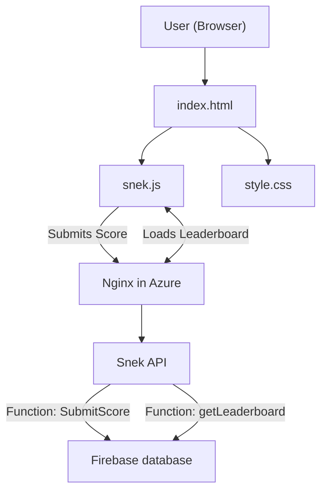

# RBBSec Snek Hunter Website



Resource Group: Website
VM: API (Linux and running Ubuntu)

/etc/nginx/sites-available/api.rbbsec.com

```
server {
    listen 80;
    server_name api.rbbsec.com;

    location /api/submitScore {
        proxy_pass https://snek-api-huhkdfbbcrbwcvhf.australiaeast-01.azurewebsites.net/api/submitScore;
        proxy_set_header Host $host;
        proxy_set_header X-Real-IP $remote_addr;
        proxy_set_header X-Forwarded-For $proxy_add_x_forwarded_for;
    }

    location /api/getLeaderboard {
        proxy_pass https://snek-api-huhkdfbbcrbwcvhf.australiaeast-01.azurewebsites.net/api/getLeaderboard;
        proxy_set_header Host $host;
        proxy_set_header X-Real-IP $remote_addr;
        proxy_set_header X-Forwarded-For $proxy_add_x_forwarded_for;
    }

    # Redirect anything else to main website
        location / {
        return 301 https://www.rbbsec.com;
    }
}
```


### Azure Function: `snek-api`

Access restrictions to the nginx proxy IP

```
az functionapp config access-restriction show --resource-group website  --name snek-api  
{
  "ipSecurityRestrictions": [
    {
      "action": "Allow",
      "additional_properties": {},
      "description": null,
      "headers": null,
      "ip_address": "20.211.145.98/32",
      "name": "nginx",
      "priority": 300,
      "subnet_mask": null,
      "subnet_traffic_tag": null,
      "tag": "Default",
      "vnet_subnet_resource_id": null,
      "vnet_traffic_tag": null
    },
    {
      "action": "Deny",
      "additional_properties": {},
      "description": "Deny all access",
      "headers": null,
      "ip_address": "Any",
      "name": "Deny all",
      "priority": 2147483647,
      "subnet_mask": null,
      "subnet_traffic_tag": null,
      "tag": null,
      "vnet_subnet_resource_id": null,
      "vnet_traffic_tag": null
    }
  ],
  "ipSecurityRestrictionsDefaultAction": "Deny",
  "scmIpSecurityRestrictions": [
    {
      "action": "Allow",
      "additional_properties": {},
      "description": "Allow all access",
      "headers": null,
      "ip_address": "Any",
      "name": "Allow all",
      "priority": 2147483647,
      "subnet_mask": null,
      "subnet_traffic_tag": null,
      "tag": null,
      "vnet_subnet_resource_id": null,
      "vnet_traffic_tag": null
    }
  ],
  "scmIpSecurityRestrictionsDefaultAction": "Allow",
  "scmIpSecurityRestrictionsUseMain": true
}
```